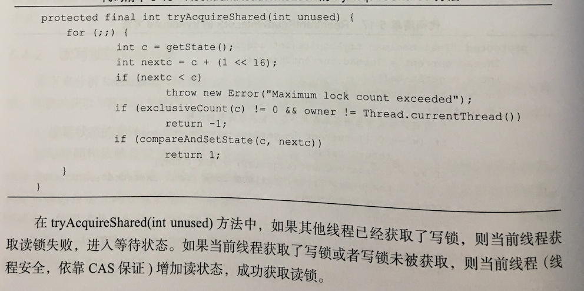

### BlockingQueue

#### ArrayBlockingQueue
底层使用数组存储元素
```java
    /** The queued items */
    final Object[] items;
```
用来记录take和put的下标
```java
    /** items index for next take, poll, peek or remove */
    int takeIndex;

    /** items index for next put, offer, or add */
    int putIndex;
```
用来进行并发控制
```java
    /** Main lock guarding all access */
    final ReentrantLock lock;

    /** Condition for waiting takes */
    private final Condition notEmpty;

    /** Condition for waiting puts */
    private final Condition notFull;
```
通过源码可以发现put和take会阻塞
```java
public void put(E e) throws InterruptedException {
    checkNotNull(e);
    final ReentrantLock lock = this.lock;
    lock.lockInterruptibly();
    try {
        while (count == items.length)
            notFull.await();
        enqueue(e);
    } finally {
        lock.unlock();
    }
}

private void enqueue(E x) {
    // assert lock.getHoldCount() == 1;
    // assert items[putIndex] == null;
    final Object[] items = this.items;
    items[putIndex] = x;
    if (++putIndex == items.length)
        putIndex = 0;
    count++;
    notEmpty.signal();
}


public E take() throws InterruptedException {
    final ReentrantLock lock = this.lock;
    lock.lockInterruptibly();
    try {
        while (count == 0)
            notEmpty.await();
        return dequeue();
    } finally {
        lock.unlock();
    }
}

private E dequeue() {
    // assert lock.getHoldCount() == 1;
    // assert items[takeIndex] != null;
    final Object[] items = this.items;
    @SuppressWarnings("unchecked")
    E x = (E) items[takeIndex];
    items[takeIndex] = null;
    if (++takeIndex == items.length)
        takeIndex = 0;
    count--;
    if (itrs != null)
        itrs.elementDequeued();
    notFull.signal();
    return x;
}
```
offer和poll则直接返回false和null
```java
public boolean offer(E e) {
    checkNotNull(e);
    final ReentrantLock lock = this.lock;
    lock.lock();
    try {
        if (count == items.length)
            return false;
        else {
            enqueue(e);
            return true;
        }
    } finally {
        lock.unlock();
    }
}
public E poll() {
    final ReentrantLock lock = this.lock;
    lock.lock();
    try {
        return (count == 0) ? null : dequeue();
    } finally {
        lock.unlock();
    }
}
```

#### LinkedBlockingQueue
底层使用链表存储元素
使用了两把锁，可以让put和take和不相扰
通过notEmpty、notFull来对生产和消费进行同步

```java
/** Lock held by take, poll, etc */
private final ReentrantLock takeLock = new ReentrantLock();

/** Wait queue for waiting takes */
private final Condition notEmpty = takeLock.newCondition();

/** Lock held by put, offer, etc */
private final ReentrantLock putLock = new ReentrantLock();

/** Wait queue for waiting puts */
private final Condition notFull = putLock.newCondition();
```
put和take实现源码
```java
public void put(E e) throws InterruptedException {
    if (e == null) throw new NullPointerException();
    int c = -1;
    Node<E> node = new Node<E>(e);
    final ReentrantLock putLock = this.putLock;
    final AtomicInteger count = this.count;
    putLock.lockInterruptibly();
    try {
        while (count.get() == capacity) {
            notFull.await();
        }
        enqueue(node);
        c = count.getAndIncrement();
        if (c + 1 < capacity)
            notFull.signal();
    } finally {
        putLock.unlock();
    }
    if (c == 0)
        signalNotEmpty();
}

public E take() throws InterruptedException {
    E x;
    int c = -1;
    final AtomicInteger count = this.count;
    final ReentrantLock takeLock = this.takeLock;
    takeLock.lockInterruptibly();
    try {
        while (count.get() == 0) {
            notEmpty.await();
        }
        x = dequeue();
        c = count.getAndDecrement();
        if (c > 1)
            notEmpty.signal();
    } finally {
        takeLock.unlock();
    }
    if (c == capacity)
        signalNotFull();
    return x;
}
```
### ReadWriteLock
#### 简介

通过32位的整型值来表示读写锁的获取状态：

基于AQS的实现，ReentrantReadWriteLock中Sync类的主要属性和方法：

```java
// 读锁同步状态占用的位数
static final int SHARED_SHIFT   = 16;
// 每次增加读锁同步状态，就相当于增加SHARED_UNIT
static final int SHARED_UNIT    = (1 << SHARED_SHIFT);
// 读锁或写锁的最大请求数量（包含重入）
static final int MAX_COUNT      = (1 << SHARED_SHIFT) - 1;
// 低16位的MASK，用来计算写锁的同步状态
static final int EXCLUSIVE_MASK = (1 << SHARED_SHIFT) - 1;
// 返回共享锁数
static int sharedCount(int c)    { return c >>> SHARED_SHIFT; }
// 返回独占锁数
static int exclusiveCount(int c) { return c & EXCLUSIVE_MASK; }
```

- 读锁状态的获取：S >> 16
- 读锁状态的增加：S + (1 << 16)
- 写锁状态的获取：S & 0x0000FFFF
- 写锁状态的增加：S + 1

#### 写锁的获取与释放
获取：
WriteLock类提供了lock()方法获取写锁，写锁的获取最终会调用Sync类的tryAcquire(int)方法

```java
protected final boolean tryAcquire(int acquires) {
	Thread current = Thread.currentThread();
	int c = getState();
	int w = exclusiveCount(c);
	if (c != 0) {
		// 不能再获取写锁 有读锁被获取，写锁获取数为0 或者当前
		// 线程不是写锁的获取者时 都应该获取失败
		if (w == 0 || current != getExclusiveOwnerThread())
			return false;
		//如果超过最大允许
		if (w + exclusiveCount(acquires) > MAX_COUNT)
			throw new Error("Maximum lock count exceeded");
		setState(c + acquires);
		return true;
	}
	if (writerShouldBlock() || !compareAndSetState(c, c + acquires))
		return false;
	setExclusiveOwnerThread(current);
	return true;
}
```
释放：
写锁的释放最终会调用Sync类的tryRelease(int)方法
```java
protected final boolean tryRelease(int releases) {
    // 当前线程不是写锁的持有线程
    if (!isHeldExclusively())
        throw new IllegalMonitorStateException();
    // 计算新的同步状态
    int nextc = getState() - releases;
    // 判断写锁是否完全释放，若是，则将写锁持有线程设置为null
    boolean free = exclusiveCount(nextc) == 0;
    if (free)
        setExclusiveOwnerThread(null);
    // 更新状态 独占，可以直接更新
    setState(nextc);
    return free;
}
```

#### 读锁的获取与释放

获取：
删除部分代码，由于通过ThreadLocal维护了每个线程获取的读锁数量(getReadHoldCount())，代码变得复杂

释放:


```java
protected final boolean tryReleaseShared(int unused) {
    for (;;) {
        int c = getState();
        int nextc = c - SHARED_UNIT;
        if (compareAndSetState(c, nextc))
            // Releasing the read lock has no effect on readers,
            // but it may allow waiting writers to proceed if
            // both read and write locks are now free.
            return nextc == 0;
    }
}
```

