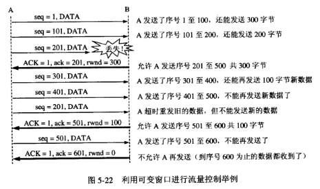
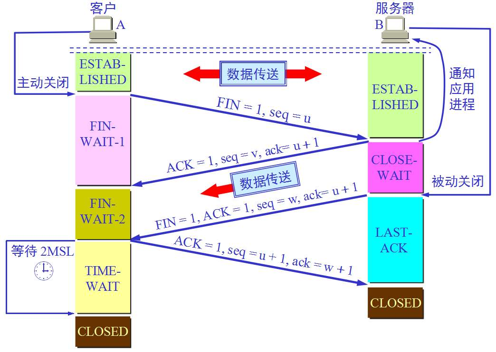
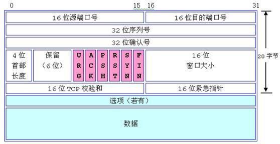
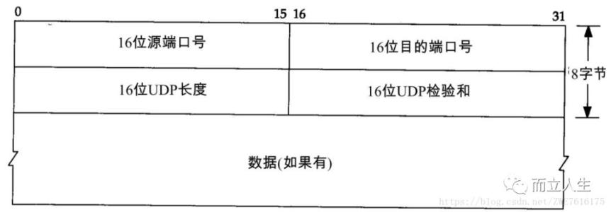

# **专业基础**

## **进程和线程的区别**

 

进程是程序的运行实例，是向操作系统申请资源的基本单位。

线程是进程中可独立运行的最小单位，一个进程可以包含多个线程。

每个进程有自己独立的内存空间，文件句柄，数据集。

这些资源会被线程共享，同时在这基础上线程拥有独立的栈空间、局部变量表、程序计数器

 

 

 

 

 

 

## **TCP和UDP的区别**

TCP面向连接，传输数据之前要需要建立会话。UDP是无连接的。

TCP提供可靠传输，保证数据不丢包、不重复且按顺序到达；UDP只尽努力交付，不保证可靠交付

TCP提供了流量控制来协调双方传输数据的速度；UDP不提供

TCP只支持点到点通信；UDP支持一对一、一对多、多对多的交互通信。

TCP首部开销大20字节，UDP首部开销小8字节。

## **TCP实现可靠传输的机制**

序列号、确认应答、重传机制(超时定时器)

**流量控制(窗口大小)、**

 

当窗口值为0，而接受方把窗口值恢复（比如ACK=1，ack=601，rwnd=200），但确认丢失，进入相互等待的死锁局面。所以如果窗口值为0，**发送端就会开启一个持续计数器，每个一段时间询问一下接收方。**

 

 

 

 

 

 

**拥塞控制**

swnd=min（rwnd，cwnd），cwnd就是拥塞窗口大小。

慢开始和拥塞避免

 

ssthresh：处理拥塞时参照的一个参数。例子中初始值为16，后来变为12。

当cwnd> ssthresh，cwnd以慢开始的方法指数增长；

当cwnd< ssthresh，cwnd以拥塞避免的方法线性增长。

值得注意的几个点

1上图是cwnd随传输轮次的变化，每过一个RTT就算一轮。

2超时就可以认为是拥塞了

快重传和快恢复：上一个算法的加强版

 

快重传：收到3个同样的确认就立刻重传，不等到超时；

快恢复：cwnd不是从1重新开始。

## **三握四挥**

## **TCP和UDP报文格式**

## **GET和POST的区别**

 

GET和POST都是TCP数据包，并无差别。但是由于HTTP的规定和浏览器/服务器的限制，导致他们在应用过程中体现出一些不同，

get请求通过url传递参数所以会受到长度限制，post没有这个限制。

get请求可以被浏览器缓存，post不可以。 

GET请求是幂等的，多次请求的结果是一样，而POST不幂等。

## **HTTP的报文格式**

 

## **HTTP方法**

GET	获取资源	1.0、1.1

POST	传输实体主体	1.0、1.1

PUT	传输文件	1.0、1.1

HEAD	获得报文首部	1.0、1.1

DELETE	删除文件	1.0、1.1

OPTIONS	询问支持的方法	1.1

# **Java**

 

## **String、StringBuffer、StringBuilder**

**String为什么是final**

主要是为了”安全性“和”效率“的缘故，因为：

1、避免了因为继承引起的安全隐患，由于String类被final修饰，所以就不会没修改；

2、有助于共享，提高性能，String类在程序中是用的比较多的，可以将字符串对象保存在字符串常量池中以供与字面值相同字符串对象共享。

3、这样在多线程时，对String对象的访问是可以保证安全的。String被设计为不变类，其中的value[]都被设计成private final的。

**三者区别**

 

**StringBuilder**

 

 

 

**StringBuffer**

 

通过底层代码我们可以看到StringBuilder 与StringBuffer在拼接字符串时，通过判断字符串长度是否足够，从而创建一个新的数组用来封装数据，而原来的对象被放弃引用，等待垃圾回收，从而减少内存的浪费，因此在拼接字符串等操作时，我们通常使用StringBuilder 与StringBuffer，但两者在执行效率上又有不同，因为StringBuffer是线程安全的。 

StringBuffer、StringBuilder的方法都会调用AbstractStringBuilder中的公共方法，如上面的两段源码中都调用了super.append(str); 只是StringBuffer会在方法上加synchronized关键字，进行同步。

**String**

String类中使用字符数组保存字符串，如下就是，因为有“final”修饰符，所以可以知道string对象是不可变的。在每次对string类型进行改变的时候其实都等同与生成了一个新的String对象.然后引用指向这个新的String对象

总结:

String：适用于少量的字符串操作的情况

StringBuilder：适用于单线程下在字符缓冲区进行大量操作的情况

StringBuffer：适用多线程下在字符缓冲区进行大量操作的情况

 

## **HashMap**

**序言**

HashMap

底层使用数组加链表存储数据 .采用链地址法解决冲突，1.8之后引入了红黑树来优化hash冲突较多导致链表过长的现象。不是线程安全的，所以在多线程情况下会有线程安全的问题。它的容量始终是会保持在2的n次方，这个容量在计算hash值和扩容的时候，是有好处的。

**核心方法**

**hash**

static final int hash(Object key) {

​    int h;

​    return (key == null) ? 0 : (h = key.hashCode()) ^ (h >>> 16);

}

HashMap的散列方法如上，其实就是将hash值的高16位和低16位异或，我们将马上看到hash在与n - 1相与的时候，高位的信息也被考虑了，能使碰撞的概率减小，散列得更均匀。

 

关键就是这句`(n - 1) & hash`，这行代码是把待插入的结点散列到数组中某个下标中， n是table的容量即`table.length`，2的次幂用二进制表示的话，只有最高位为1，其余为都是0。减去1，刚好就反了过来。可以**使得散列值分布得更均匀**，且当n为2的次幂时候有`(n - 1) & hash == hash % n`, **使用位运算效率更高。**

 

**put**

put方法主要由putVal方法实现：

1.如果没有产生hash冲突，直接在数组tab[i = (n - 1) & hash]处新建一个结点；

2.否则，发生了hash冲突，此时key如果和头结点的key相同，不进行查找过程，直接跳到最后去更新值

3.否则，如果数组下标中的类型是TreeNode，就插入到红黑树中

4.如果上面的条件都不满足，那就是只是普通的链表，就在链表中查找或替换，找到key相同的结点就跳出，到最后去更新值；如果说到链表尾也没有找到key相同的结点就在尾部插入一个新结点。接着判断此时链表长度若大于8的话，还需要将链表转为红黑树。

5.最后会检查元素大小是否超过阀值，来决定要不要进行一个扩容。

final V putVal(int hash, K key, V value, boolean onlyIfAbsent,

​                   boolean evict) {

​        Node<K,V>[] tab; Node<K,V> p; int n, i;

​        if ((tab = table) == null || (n = tab.length) == 0)

​            n = (tab = resize()).length;

​        if ((p = tab[i = (n - 1) & hash]) == null)

​            tab[i] = newNode(hash, key, value, null);

​        else {

​            Node<K,V> e; K k;

​            if (p.hash == hash &&

​                ((k = p.key) == key || (key != null && key.equals(k))))

​                e = p;

​            else if (p instanceof TreeNode)

​                e = ((TreeNode<K,V>)p).putTreeVal(this, tab, hash, key, value);

​            else {

​                for (int binCount = 0; ; ++binCount) {

​                    if ((e = p.next) == null) {

​                        p.next = newNode(hash, key, value, null);

​                        if (binCount >= TREEIFY_THRESHOLD - 1) // -1 for 1st

​                            treeifyBin(tab, hash);

​                        break;

​                    }

​                    if (e.hash == hash &&

​                        ((k = e.key) == key || (key != null && key.equals(k))))

​                        break;

​                    p = e;

​                }

​            }

​            if (e != null) { // existing mapping for key

​                V oldValue = e.value;

​                if (!onlyIfAbsent || oldValue == null)

​                    e.value = value;

​                afterNodeAccess(e);

​                return oldValue;

​            }

​        }

​        ++modCount;

​        if (++size > threshold)

​            resize();

​        afterNodeInsertion(evict);

​        return null;

​    }

**resize**

扩容在1.8中是有初始功能的

 

**指定容量使用指定容量，没有指定使用默认容量。**

**已有哈希表扩容时，容量、阈值均翻倍**

if (oldTab != null) {

​            for (int j = 0; j < oldCap; ++j) {

​                Node<K,V> e;

​                if ((e = oldTab[j]) != null) {

​                    oldTab[j] = null;

​                    // 如果数组中只有一个元素，即只有一个头结点，重新哈希到新数组的某个下标

​                    if (e.next == null)

​                        newTab[e.hash & (newCap - 1)] = e;

​                    else if (e instanceof TreeNode)

​                        ((TreeNode<K,V>)e).split(this, newTab, j, oldCap);

​                    else { // preserve order

​                        // 数组下标处的链表长度大于1，非红黑树的情况

​                        Node<K,V> loHead = null, loTail = null;

​                        Node<K,V> hiHead = null, hiTail = null;

​                        Node<K,V> next;

​                        do {

​                            next = e.next;

​                            // oldCap是2的次幂，最高位是1，其余为是0，哈希值和其相与，根据哈希值的最高位是1还是0，链表被拆分成两条，哈希值最高位是0分到loHead。

​                            if ((e.hash & oldCap) == 0) {

​                                if (loTail == null)

​                                    loHead = e;

​                                else

​                                    loTail.next = e;

​                                loTail = e;

​                            }

​                            // 哈希值最高位是1分到hiHead

​                            else {

​                                if (hiTail == null)

​                                    hiHead = e;

​                                else

​                                    hiTail.next = e;

​                                hiTail = e;

​                            }

​                        } while ((e = next) != null);

​                        if (loTail != null) {

​                            loTail.next = null;

​                            // loHead挂到新数组[原下标]处；

​                            newTab[j] = loHead;

​                        }

​                        if (hiTail != null) {

​                            hiTail.next = null;

​                            // hiHead挂到新数组中[原下标+oldCap]处

​                            newTab[j + oldCap] = hiHead;

​                        }

​                    }

​                }

​            }

​        }

​        return newTab;

举个例子，比如oldCap是16，二进制表示是10000，hash值的后五位和oldCap相与，因为oldCap的最高位（从右往左数的第5位）是1其余位是0，因此hash值的该位是0的所有元素被分到一条链表，挂到新数组中原下标处，hash值该位为1的被分到另外一条链表，挂到新数组中原下标+oldCap处。举个例子：桶0中的元素其hash值后五位是0XXXX的就被分到桶0种，其hash值后五位是1XXXX就被分到桶4中。(组之间保持原来的顺序，这样计算很巧妙阿，不用对每个元素计算hash了)

 

扩容过程中几个关键的点：

新初始化哈希表时，容量为默认容量，阈值为 容量*加载因子

如果之前这个桶的节点类型是树，需要把新哈希表里当前桶也变成树形结构

 

**线程不安全表现**

主要表现在resize()时会产生环形链表(1.7中)

因为采用的是头插法，如果一个线程**执行扩容的时候被时间片用完，而另一个线程完成了扩容过程**，则**这时对线程一来说，链表就产生逆序**了，会让后面的结点指向前面的结点，从而形成环。

1.7中put可能会导致数据丢失，扩容时会产生两个表，put进的数据还是放在旧表中，这样如何放到了已经扫过的链，就不会进行迁移。

put时只会保留最后执行的结果，造成数据不一致

(1.7中的put用的是头插，1.8用的是尾插，包括在rehash中)

## **HashMap和HashTable的区别**

1.map线程不安全，table通过syn保证线程安全

2.map的key和value允许为null，table则不允许

3. 初始容量和扩容时的大小不同，map是16，扩容容量翻倍且保持在2^n，table是11,扩容每次容量2*n+1

4.计算hash方法不同，map：hashcode高16位和低十六位进行异或  table是直接用hashcode

 

 

 

 

 

 

 

## **ArrayList和LinkedList的区别**

1.ArrayList是实现了基于动态数组的数据结构，LinkedList基于双向链表的数据结构。 所以arraylist是有界的，这个界是Integer的最大值。LinkedList在设计上没有容量的限制。

2.ArrayList支持随机访问，而LinkedList必须要通过指针来遍历。 

3.对于插入和删除操作ArrayList要通过System.arraycopy方法移动数据，虽然它是一个用C实现的native方法。 但是需要把数组的一部分元素给挪动一遍，这个开销在数据比较多的时候是比较大的。LinedList比较占优势，因为只要改变几个指针的值就可以了。

4.LinkedLit实现了Deque接口，所以可以当做栈和队列使用。

## **ConcurrentHashMap**

序言

ConcurrentHashMap出现的背景是线程不安全的HashMap、效率低下的HashTable容器

它底层是一个Segment数组，Segment继承自ReentrantLock，所以它本身就是一把锁。

这种分段锁机制可以很好的提升并发性，因为它使得段与段之间的访问是各自独立的。

定位段的两个参数:segmentShift，segmentMask 

Segment[] = 16(默认的并发级别)，则n = log16 = 4

segmentShift = 32-4 = 28  segmentMask = 2^n-1 = 15

Segment[hash >>>segmentShift & segmentMask]

 

 

 

get方法在多线程put和remove下线程安全的原因?

## **Synchronized**

synchronized可以修饰方法和代码块，这两种情况它们在字节码的表示层面是不一样的，

用javap反编译之后

可以看到对于同步方法它的标志符里面多了一个ACC_SYNCHRONIZED

如果设置了这个标志符，执行线程将先获取monitor，获取成功之后才能执行方法体，方法执行完后再释放monitor。

而对于同步代码块来说，它通过monitorenter 和monitorexit这两条字节码指令来实现的，

线程执行monitorenter指令时尝试获取monitor的所有权，这又会有两种情况

如果monitor的计数为0 或者 当前线程是在这个monitor上重入，则线程可以直接进入，

否则线程就会阻塞在这里来等待这个计数重新为0。

## **volatile**

　　1.保证此变量对所有的线程的可见性，这里的“可见性”，如本文开头所述，当一个线程修改了这个变量的值，volatile 保证了新值能立即同步到主内存，以及每次使用前立即从主内存刷新。

 

　　2.禁止指令重排序优化。有volatile修饰的变量，赋值后多执行了一个“lock addl $0x0, (%esp)”操作，这个操作相当于一个内存屏障（指令重排序时不能把后面的指令重排序到内存屏障之前的位置），只有一个CPU访问内存时，并不需要内存屏障；（什么是指令重排序：是指CPU采用了允许将多条指令不按程序规定的顺序分开发送给各相应电路单元处理）。

 

 

 

 

当一个变量被定义成volatile之后，这个变量就具备了两层语义

1. 保证不同线程对这个变量操作时的可见性，

2. 保证有序性，禁止这个指令进行重排序，

 

可见性的含义是说当一个线程对变量进行修改之后，对其它线程来说，是可以立即感知的。

Java内存模型规定了，所有的变量都存储在主内存里面，同时每个线程都有自己的工作内存，

线程工作的时候会从主内存中拷贝一个副本，被volatile修饰的变量修改之后，会将这个值刷新到主内存中，同时会使这个变量的缓存无效，其它线程需要读取的时候，必须从主内存里面读。

 

有序性是通过CPU的Lock指令，这个指令有一个内存屏障的作用，保证之后的指令不会重排到这个lock指令之前。这里面对volatile变量还有一个先行发生原则，保证写操作是优先于写操作的，这样每次读取到的都是最新的值。

## **happens-before原则**

1.程序次序规则：

2.锁定原则：

3.volatile变量规则

4.传递规则

5.线程启动原则：

6.线程中断规则：

7.线程终结原则：

8.对象的终结规则：

 

## **Synchronized与Lock的区别**

1.首先synchronized是java内置关键字，在jvm层面，Lock是个java类 是API层面，；

 

2.synchronized无法判断是否获取锁的状态，以及不可中断的获取锁，Lock可以；

 

3.synchronized在退出同步区域时会自动释放锁，而Lock需在finally中手工释放锁，否则容易造成线程死锁；

4.synchronized是不公平的，Lock可以实现公平锁(因为它用到了AQS队列同步器)，读写锁。

 

## **谈谈你对线程池的理解**

**what**

“线程池”顾名思义，就是存放线程的池子，线程池是一种多线程处理形式，一种对线程的管理方法。

**why**

1. 复用已经存在的线程，减少了这个线程创建和销毁的这个开销

2. 提高了线程的可管理性，可以有效的控制最大并发线程数，避免了过多的资源竞争

3. 提供了定期执行、定时执行、单线程控制功能

**how：**

在用这个线程池处理多线程的形式下，任务是提交给整个线程池，而不是直接提交给某个线程，线程池在拿到任务后，会寻找是否有空闲的线程，如果有，则将任务交给某个空闲的线程。如果没有则将线程放进等待队列，这个队列指定是有界的还是无界的，无界的队列可以一直接收任务，而有界的队列在满了之后则会执行拒绝策略，默认是会抛一个异常。

 

## **execute和submit的区别：**

public interface Executor {

​    void execute(Runnable command);

}

 

public interface ExecutorService extends Executor {

​    <T> Future<T> submit(Callable<T> task);

​    <T> Future<T> submit(Runnable task, T result);

​    Future<?> submit(Runnable task);

}

 

 

## **抽象类和接口的区别**

抽象类是用来捕捉子类的通用特性的 。它不能被实例化，只能被用作子类的超类。抽象类是被用来创建继承层级里子类的模板。

 

而接口像是定义一个契约，接口中是抽象方法的集合。如果一个类实现了某个接口，那么就必须确保实现这些方法。 或者让一个类具备某种特性。比如说Serializable。实现这个接口的类就能被序列化。接口只是一种形式，接口自身不能做任何事情。

 

## **受检型异常和运行时异常**

受检型异常其必须被try...catch语句块所捕获,或者在方法签名里通过throws子句声明。

运行时异常, 需要程序员自己分析代码决定是否捕获和处理,比如空指针,被0除，以及对不些不合法参数的检查。

受检型异常代表:ReflectiveOperationException IOException

运行时异常代表:RuntimeException

# **框架**

## 谈谈你对Spring的理解

Spring框架是由于软件开发的复杂性而创建的。Spring发展至今已经是一个十分庞大的体系，有很多子项目像：

- SpringFramework 提供了基础的IOC、AOP
- SpringData 为访问各种数据源提供了一个统一的接口
- SpringSecurity 权限管理
- SpringBoot 快速开发
- SpringCloud 微服务一站式解决方案

Spring的优点
1.通过容器来管理对象方便解耦合
2.AOP的支持，可以方便的将散布在系统中多个部分的代码抽取出来
3.声明式事务的支持，只需要通过配置或注解就能处理事务，无需手动编程
4.方便集成各种优秀框架

## 说说SpringBoot

SpringBoot是Spring的扩展，以往我们开发一个基于Spring的应用程序，遇到一些框架整合的场景，需要我们自己管理依赖以及编写大量的配置文件。这其实挺麻烦的，偶尔也会有小坑出现，非常影响开发进度。SpringBoot就是来解决这个问题的，对常用的框架提供默认的配置，提供可插拔的设计，提供了对依赖的合成starter，各种需要的框架，加入starter就配置好了，追求开箱即用的效果。同时内嵌tomcat和jetty容器，不需要单独安装容器，jar包直接发布一个web应用。

## 说说Spring和SpringBoot的区别

Spring Boot只是Spring本身的扩展，他们的区别主要有这么两点：
 1.SpringBoot提供了starter快速整合其它框架
 2.内嵌tomcat和jetty容器，可以直接从main函数运行
总之让我们开发和部署Spring应用更加的方便。

## 说说SpringCloud

SpringCloud是基于SpringBoot的一套的全站式微服务的解决方案。它提供了微服务开发所需的服务发现、熔断限流、网关路由、消息总线、负载均衡，本质上都是基于nexflix开源的框架，Spring团队做了一个集成。最重要的是，跟SpringBoot一起使用的话，可以让会微服务开发起来非常方便。

## **SpringMVC的工作原理**

1、  用户发送请求至前端控制器DispatcherServlet。

 

2、  DispatcherServlet收到请求调用HandlerMapping处理器映射器。

 

3、  处理器映射器通过url找到具体的处理器(可以根据xml配置、注解进行查找)，生成处理器对象及处理器拦截器(如果有则生成)一并返回给DispatcherServlet。

 

4、  DispatcherServlet调用HandlerAdapter处理器适配器。

 

5、  HandlerAdapter经过适配调用具体的处理器(Controller，也叫后端控制器)。

 

6、  Controller执行完成返回ModelAndView。

 

7、  HandlerAdapter将controller执行结果ModelAndView返回给DispatcherServlet。

 

8、  DispatcherServlet将ModelAndView传给ViewReslover视图解析器。

 

9、  ViewReslover解析后返回具体View。

 

10、DispatcherServlet根据View进行渲染视图（即将模型数据填充至视图中）。

 

11、 DispatcherServlet响应用户。

 

 

## **对Spring IOC AOP的理解**

**IOC**

传统上由程序代码直接new对象，这样的缺点是耦合度太高。即便是在面向接口编程的场合，如果我想更改一个类的实现类。那我就需要改代码，并且所有用到这个类的地方都要改。

控制反转是把创建对象的权利交给Spring容器，通过IOC容器动态注入解耦合，如果要修改实现类只要改配置文件就可以了。

**AOP**

AOP它利用一种称为“横切”的技术，将那些跨横切面的逻辑抽取出来封装到一个可重用切面。

例如日志功能。日志代码往往水平地散布在所有对象层次中，而与它所散布到的对象的核心功能毫无关系。类以的还有，如权限检查、异常处理、事务管理也是类似的。

AOP的好处就是可以将那些与业务无关，却为业务模块所共同调用的逻辑封装起来，便于减少系统的重复代码以及做一个统一的管理。

## **Mybatis#和$的区别**

 

 

## ES写数据流程

1）客户端选择一个node发送请求过去，这个node就是coordinating node（协调节点）
2）coordinating node，对document进行路由，将请求转发给对应的node（有primary shard）
3）实际的node上的primary shard处理请求，然后将数据同步到replica node
4）coordinating node，如果发现primary node和所有replica node都搞定之后，就返回响应结果给客户端

# 微服务
## 怎么理解微服务

微服务是一种架构模式，我们以往将整个系统都是部署在一个单体应用上，而微服务它将原本的单体应用拆分拆分成一组小的微服务，这些微服务可以独立开发和部署。它和单体应用相比优点有这个我总结了下主要有这么三点：

1.每个微服务组件都是简单灵活的，能够独立开发部署。每个微服务可以交给一个小团队负责，这样就能更专注和可靠。

2.微服务之间是松耦合的，每个微服务很容易按需扩展，我们遇到性能瓶颈的时候可以动态的扩容和缩容。
3、微服务架构采用去中心化思想，服务之间采用RESTful等轻量协议通信。

但是微服务也带来了一些问题：

1.运维复杂度增加了，我们整个系统可能存在几十甚至上百个微服务，我们要对这些微服务做管理和监控，无疑增加了我们这个运维人员的复杂性。
2.微服务也带来了分布式的问题，比如分布式事务，还有就是我们依赖服务不稳定、或者不可用，这些问题我们都需要去解决。

## 服务拆分的原则

# **JVM**

## **垃圾收集算法**

复制算法，标记清除， 标记整理， 分代收集。

## **哪些对象可以作为GC Roots**

方法区中类静态属性引用的对象（static）

方法区中常量引用的对象（final）

虚拟机栈中引用的对象

本地方法栈中引用的对象

## **CMS收集器**

CMS(Concurrent Mark Sweep)收集器是一种获取最短回收停顿时间为目标的收集器，基于"标记-清除"算法实现，整个过程分为四步

**初始标记(CMS initial mark)->并发标记(CMS concurrent mark)->重新标记 (CMS remark)->并发清除 (CMS concurrent sweep)**

初始标记、重新标记着两个步骤任然需要"Stop The World"，{初始标记仅仅只是标记一下GCRoots能直接关联到的对象}，速度很快，{并发标记就是进行GC Roots Tracing 的过程}，而{重新标记阶段则是为了修正并发标记期间因用户程序继续运行而导致标记产品变动的那一部分对象的标记记录}。这个阶段的停顿时间一般会比初始标记阶段稍长一些。，但远比并发标记的时间短。

由于整个过程耗时最长的并发标记和并发清除都可以和用户线程一起工作，所以从总体上来说，CMS收集器的内存回收过程是与用户线程一起并发执行的。CMS是一款优秀的收集器，它的主要优点在于：并发收集、低停顿。

CMS 收集器的缺点

-	**CMS收集器对CPU非常敏感**。其实面向并发设计的程序都对CPU比较敏感，在并发阶段，虽然不会导致用户线程停顿，但是会因为占用了一部分线程(或者说CPU资源)而导致应用程序变慢，总吞吐量降低。CMS默认启动的回收线程数是(CPU数量+3)/4,也就是当CPU在4个以上时，并发回收时，垃圾收集线程不少于25%的CPU资源，并且随着CPU数量的增加而下降。但是当CPU数量不足4个时，CMS对用户程序的影响就可能变的很大。如果CPU负载本来就很大，还要分出一半的运行能力去执行收集器线程，就可能导致用户程序的执行能力下降50%

 

-	**CMS收集器无法处理浮动垃圾**。可能出现"Concurrent Mode Failure"失败而导致另一次Full GC。由于CMS并发清理阶段用户线程还在运行着，伴随着程序的运行自然就还会有新的垃圾不断产生，这一部分产生的垃圾，CMS无法在当次收集中处理掉他们，只要留待下一次GC再进行处理。这一部分产生的垃圾成为"浮动垃圾"。也是由于在垃圾收集阶段用户线程还要继续运行，那也就还需要预留足够的内存空间给用户线程使用。因此CMS收集器不能像其他收集器那样，等到老年代被填满后再进行垃圾回收。需要预留一部分空间供并发收集时的程序运行使用。

 

-	**由于CMS采用"标记清理"算法实现**，所以当垃圾收集后，会产生大量的内存碎片。空间碎片过多，当程序运行需要分配大对象时，由于找不到连续的内存空间，而不得不提前触发一次Full GC.CMS采用了-XX:+UseCMSCompactAtFullCollection开关参数，用于在CMS收集器顶不住要进行Full GC时开启内存碎片的合并整理过程。内存碎片的整理是无法并发执行的，空间碎片问题没有了，但是随之而来的停顿时间变长了。因此，虚拟机设计者还提供了一个参数：-XX:CMSFullGCsBeforeCompaction来进行设置执行多少次不压缩的Full GC后进行一次带压缩的(默认是0.标识每次进入Full GC后都会带有一次内存压缩)

 

 

# Redis
## Redis为什么这么快

1.它是用C语言写的，完全基于内存，对数据的读和写都是在内存中完成。
2.数据结构也帮了不少忙，Redis大量使用hash结构，还有一些特殊的数据结构，压缩表，对短数据进行压缩存储，再如，跳表，使用有序的数据结构加快读取的速度。
3.Redis使用IO多路复用，使用了单线程来轮询描述符，将数据读、写都转换成了事件，减少了线程切换时上下文的切换和竞争。

## Redis的持久化

Redis提供了两种数据持久化的方式：
1、RDB持久化方式能够在指定的时间间隔能对你的数据进行快照存储。有两个命令可以用于生成RDB文件。
SAVE和BGSAVA。区别是SAVE会阻塞服务器进行，导致这段时间不能提供服务。BGSAVE会派生出一个子进程。

2、AOF持久化方式记录每次对服务器写的命令来保存数据库的状态,当服务器重启的时候会重新执行这些命令来对数据进行恢复。然后它的一个过程是这样的。当服务器接到完成一个写命令之后，会将命令以协议格式的数据保存到一个aof_buff的末尾。然后会定时将这个缓冲区中的内容同步到文件中去。然后这里有一个问题就是，随着服务器的运行，这个aof文件的内容也会越来越大，那么我到时候还原的时间也越来越长。
所以Redis也提供了AOF重写的机制。这里也会fork出一个子进程。它会对数据库的状态做分析。然后将指令生成一个新的aof文件。因为我们子进程在进行aof重写的期间，服务器进程可能依然在处理数据嘛，所以这里还有一个aof重写缓冲区。会记录子进程在重写aof期间服务器新接到的写命令到aof重写缓冲区。（同时也会aof缓冲区的命令也会记录，我猜主要是为了防止重写过程失败，要保证现有的aof文件是完整的)

当我们子进行重写完成之后。会向服务器进程发送一个信号，服务器进程将aof重写缓冲区的内容写入到新的aof文件。并将新的aof文件替换成旧的aof文件。

## - Redis集群原理

## - Redis主从复制

# **数据库**

## **数据库并发控制**

## B+树索引

一颗M阶B+树每个结点有M个关键字，M个指针。它的结构特点是

关键字在结点上是有序的，第k个指针指向关键字(k-1,k)，然后内部结点不存储数据，只存储键值，所有的数据保存在叶子结点上，并且组织成了一个双向链表的形式。好处

1.每次查找都会到叶结点，所以是稳定的

2.方便范围查询，如果我们的数据是跨结点的话，可以避免会书支父结点，B+树只要通过链表走下去就可以了

3.第三点是我们可以利用程序访问局部性原理，可以减少IO次数

## **事务的ACID特性**

**原子性**：事务中的操作序列要么全部执行，要么都不执行

**一致性**：事务的执行结果从一个一致性状态到另一个一致性状态(只包含成功提交的事务，是和原子性息息相关的) 比如说转帐的例子

**隔离性：**一个事务的执行不能被其他事务干扰

**持续性：**事务一但提交，对数据库的更改应该是永久性的

## **并发事务带来的问题**

 

在典型的应用程序中，多个事务并发运行，经常会操作相同的数据来完成各自的任务（多个用户对统一数据进行操作）。并发虽然是必须的，但可能会导致以下的问题。

 

•脏读（Dirty read）: 当一个事务对数据进行了修改，而这种修改还没有提交到数据库中，这时另外一个事务访问了这个还没有提交的数据。

 

•丢失修改（Lost to modify）: 两个事务t1,t2读入同一数据并修改并提交，最终只会保留最后一个事务的提交结果，导致其它事务提交的结果

丢失了 例如：事务1读取某表中的数据A=20，事务2也读取A=20，事务1修改A=A-1，事务2也修改A=A-1，最终结果A=19，事务1的修改被丢失。

 

•不可重复读（Unrepeatableread）: 不可重复读不指事务t1读取数据后，事务t2修改了数据，使t1无法再现前一次的读取结果

 

•幻读（Phantom read）: 幻读与不可重复读类似。它发生在一个事务（T1）读取了几行数据，接着另一个并发事务（T2）插入了一些数据时。在随后的查询中，第一个事务（T1）就会发现多了一些原本不存在的记录，就好像发生了幻觉一样，所以称为幻读。

 

不可重复度和幻读区别：

 

不可重复读的重点是修改，幻读的重点在于新增或者删除。

 

例1（同样的条件, 你读取过的数据, 再次读取出来发现值不一样了 ）：事务1中的A先生读取自己的工资为 1000的操作还没完成，事务2中的B先生就修改了A的工资为2000，导 致A再读自己的工资时工资变为 2000；这就是不可重复读。

 

例2（同样的条件, 第1次和第2次读出来的记录数不一样 ）：假某工资单表中工资大于3000的有4人，事务1读取了所有工资大于3000的人，共查到4条记录，这时事务2 又插入了一条工资大于3000的记录，事务1再次读取时查到的记录就变为了5条，这样就导致了幻读。

 

 

 

## **事务的隔离级别**

SQL 标准定义了四个隔离级别：

 

•READ-UNCOMMITTED(读取未提交)： 最低的隔离级别，允许读取尚未提交的数据变更，可能会导致**脏读、不可重复读或幻读**

•READ-COMMITTED(读取已提交): 允许读取并发事务已经提交的数据，可以阻止脏读，但是**不可重复读或幻读仍有可能发生**

•REPEATABLE-READ（可重读）: 对同一字段的多次读取结果都是一致的，除非数据是被本身事务自己所修改，可以阻止脏读和不可重复读，但**幻读**仍有可能发生。

•SERIALIZABLE(可串行化): 最高的隔离级别，完全服从ACID的隔离级别。所有的事务依次逐个执行，这样事务之间就完全不可能产生干扰，也就是说，该级别可以防止脏读、不可重复读以及幻读。

 

MySQL InnoDB 存储引擎的默认支持的隔离级别是 **REPEATABLE-READ**（可重读）。我们可以通过SELECT @@tx_isolation;命令来查看

## **in和exists的区别**

https://www.jianshu.com/p/f212527d76ff

 

 

 

in不走索引?

## MyISAM 和 InnoDB 索引的区别

https://www.cnblogs.com/balfish/p/8288891.html#_label0

# **算法**

## **堆排序**

要说堆排序，我们先来说下堆这种数据结构，

堆是完全二叉树的一种：每个结点的值都大于或等于其左右孩子叫大顶堆；每个结点的值都小于或等于其左右孩子结点的值，称为小顶堆。

堆上的操作有建堆以及堆调整。

 

堆排序正是利用堆这种数据结构而设计的一种排序算法，以升序为例，堆排序的基本思想是：将待排序序列构造成一个大顶堆，此时，整个序列的最大值就是堆顶的根节点。将其与末尾元素进行交换，此时末尾就为最大值。

然后将剩余n-1个元素堆调整，再次将堆顶元素和倒数第二个位置上的数进行交换，重复这个过程n-1次，便能得到一个升序的序列了。

 

整体主要由建堆，堆调整两部分组成。其中构建初始堆经推导复杂度为O(n)，在重建堆的过程中，要重复n-1次，每次是(lgn),

所以总的时间复杂度是O(nlgn)

 

## **快速排序**

 

快速排序是冒泡排序的改进版，也是最好的一种内排序，在很多面试题中都会出现，也是作为程序员必须掌握的一种排序方法。

 

思想:

1.在待排序的元素任取一个元素作为主元(通常选第一个元素，但最的选择方法是从待排序元素中随机选取一个作为基准)，称为基准元素；

 

2.将待排序的元素进行分区，比基准元素大的元素放在它的右边，比其小的放在它的左边；

 

3.对左右两个分区重复以上步骤直到所有元素都排好序。

 

# 蘑菇街面试准备
## 1.平时是怎么学习这些技术的？比较关注哪方面？
## 2.说说类加载的过程？final变量的赋值是在哪一个阶段？
类加载主要这么五个阶段：加载、验证、准备、解析、初始化
1.加载阶段的任务就是通过类的全限定名将class文件中的二进制字节流数据读取到内存中，
然后将该字节流所代表的静态数据结构转化为方法区中运行时数据结构，并且在方法区中生成一个Class对象作为访问各种数据结构的访问入口

2.验证阶段简单来说，这一步就是根据Java虚拟机规范，来校验你加载进来的“.class”文件中的内容，是否符合指定的规范。比如文件格式是否正确、元数据信息是否符合Java语言规范、字节码文件是否会危害JVM的安全等等。

3.准备阶段为static变量分配内存并设置类变量初始值(零值 static final除外)的阶段，注意此时的设置初始值为默认值，这些变量使用的内存将在方法区中进行分配。

4.解析阶段干的事儿，实际上是把符号引用替换为直接引用的过程。

5.初始化阶段是执行类构造器<clinit>()方法的过程。类构造器<clinit>()方法是由编译器自动收集类中的所有类变量的赋值动作和静态语句块(static块)中的语句合并产生的。clinit是class initialize的简写

## 3.类加载的顺序是怎么样的？可以随意调换吗？
## 4.jvm的类加载机制是怎么样的？双亲委派模型的优势在哪里？
java中存在3种类型的类加载器：启动类加载器，扩展类加载器和系统类加载器。三者是的关系是：引导类加载器是扩展类加载器的父类，扩展类加载器是系统类加载器的父类。

JVM类加载机制采用的是双亲委派模型，如果一个类加载器接收到了类加载的请求，它首先把这个请求委托给他的父类加载器去完成，每个层次的类加载器都是如此，因此所有的加载请求都应该传送到顶层的启动类加载器中，只有当父加载器反馈自己无法完成这个加载请求子加载器才会尝试自己去加载。
它的优势在于，java类随着它的类加载器一起具备了一种带有优先级的层次关系。可以保证Java自身类库的一个唯一性，因为我们对任意一个类来说，它是由这个类本身和加载这个类的类加载器来确定它的唯一性的。双亲委派机制能保证多加载器加载某个类时，最终都是由一个加载器加载，确保最终加载结果相同。都会委派给启动类加载器进行加载。

## 5.jdk1.7和1.8之间，内存区域有什么变化？

## 6.什么时候会发生full gc
1.System.gc()方法的调用。
2.大的对象直接在老年代分配的时候，老年代空间不足。
3.老年代担保分配失败的时候。
4.永久代空间不足

## 7.spring有了解过吗？如果要自己实现控制反转，你准备怎么做？

## 8.Java实现多线程方式？问我刚才的生产者消费者还可以用什么java并发包里的那些结构写出来？ 
1、继承Thread类创建线程
2、实现Runnable接口创建线程
3、实现Callable接口通过FutureTask包装器来创建Thread线程
4、用线程池

## 9.Java中线程的状态有哪些？ 
NEW、RUNNABLE、BLOCKED、WAITING、TIMED_WAITING、TERMINATED
分别对应于：新建、运行、阻塞、等待、带超时的等待、终止

## 10.Java中wait 和sleep的区别 
wait和sleep
1.所属类不同，wait是Object对象方法，sleep()是Thread类的静态方法
2.虽然调用这两个方法产生的效果都是让线程进入等待状态，但是用法不一样，wait必须在同步代码里面使用不然会IllegalMonitorStateException，同时它会释放锁。
sleep()在同步非同步代码中都能用，不会释放锁。

## 11.动态代理和静态代理的区别
1.静态代理通常只代理一个类，动态代理是代理一个接口下的多个实现类。

2.静态也就是在程序运行前就已经存在代理类的字节码文件，代理类和委托类的关系在运行前就确定了。 动态代理在程序运行时运用反射机制动态创建而成。所以不存在代理类的字节码文件。代理类和委托类的关系是在程序运行时确定。 

## 12.redis中list的底层数据结构是什么样的 
压缩列表，当数据量大的时候会用linkedlist(数量>=512 || 长度>=64)
## 13.redis中事务是怎么实现的 

## 14.redis中server和client通信方式什么(这个真的没注意到) 

## 15.项目中除了redis你还知道还有其他哪些工具可以实现功能？ 

## 16.redis和memcached的区别，各自优势 
1)Memecache把数据全部存在内存之中,Redis有数据的持久化机制，可以将数据保存在磁盘上。

2)Memcache对数据类型支持相对单一，Redis有着丰富有数据类型。

## 17.把innodb的索引结构划给我看看 

## 18.innodb和myisam的区别 
1.Innodb提供了对ACID事务和外键的支持，MyIASM是不支持的。
2.Innodb支持行级锁，MyIASM只支持表级锁。
3.MyIASM支持全文索引，并且保存了表数据的行数。InnoDB不支持全文索引，统计行数会导致全表扫描。
4.索引结构不同。InnoDB的主键索引data域存储了完整的数据记录，而MyIASM存储的是数据记录的地址

应用场景：
MyIASM管理非事务表，提供高效查询以及全文搜索能力，如果再应用中执行大量select操作，应该选择MyIASM
InnoDB用于事务处理，具有ACID事务支持等特性，如果在应用中执行大量insert和update操作，应该选择InnoDB

## 19.介绍一下mvcc，说一下这东西有什么用 
MVCC多版本并发控制。它是数据库中乐观锁的一种实现方式。MVCC看成行级别锁的一种妥协，它在许多情况下避免了使用锁，它可以允许非阻塞式读，在写操作进行时只锁定必要的记录。

InnoDB存储引擎MVCC的实现策略是这样的：
在每一行数据中额外保存两个隐藏的列：当前行创建时的版本号和删除时的版本号（可能为空，其实还有一列称为回滚指针，用于事务回滚，不在本文范畴）。这里的版本号就是开始事务时的ID

MVCC下InnoDB的增删查改是怎么work的
1.插入数据（insert）:创建的版本号即当前事务的版本号

2.在更新操作的时候，采用的是先标记旧的那行记录为已删除，并且删除版本号是事务版本号，然后插入一行新的记录的方式。创建的版本号即当前事务的版本号

3.删除操作的时候，就把事务版本号作为删除版本号

4.在查询时要符合以下两个条件的记录才能被事务查询出来：
删除版本号未指定或者大于当前事务版本号，即查询事务开启后确保读取的行未被删除。

创建版本号小于或者等于当前事务版本号，就是说记录创建是在当前事务中或者在当前事务启动之前的其他事物进行的插入。

## 20.SpringBean的生命周期

## 21.Mybatis的一二级缓存
一级缓存只是相对于同一个SqlSession而言。所以在参数和SQL完全一样的情况下，我们使用同一个SqlSession对象调用一个Mapper方法，往往只执行一次SQL，因为使用SelSession第一次查询后，MyBatis会将其放在缓存中，以后再查询的时候，如果缓存有效，SqlSession都会取出当前缓存的数据，而不会再次发送SQL到数据库。

二级缓存是在多个SqlSession在同一个Mapper文件中共享的缓存，它是Mapper级别的，其作用域是Mapper文件中的namespace，默认是不开启的。
## 22.服务熔断原理

## HR问题
1.以后的发展方向
2.想要和什么样的同事共事 
3.对于你以后可能的师傅有什么要求 
4.什么时候开始实习到多久 
5.说一下你实验室情况，有没有谁让你印象深刻 
6.说一下拿offer的情况 
7.三四天会给你通知
8.说下你个性比较突出的地方
9.你做的这些项目是不是都是学校的？
10.你觉得学校的项目和公司里的差距在哪里？
11.对于第一份工作的选择，你比较看重什么？你对于今后的职业生涯是怎么规划和打算的？
12.关于刚刚的技术面试官，以后也有可能是你的同事或者主管，你印象如何？
13.你对于自己将来想从事的方向有没有什么想法？是想搞业务相关的，还是底层或者中间的技术？为什么想做业务这一块？
14.之前有投了别的公司吗？如果蘑菇街也给你发offer的话，你怎么选择？

