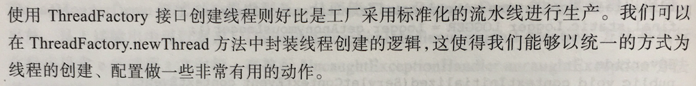

### 走近Java世界中的线程
#### 进程与线程的区别
进程是程序的运行实例，是向操作系统申请资源的基本单位。
线程是进程中可独立运行的最小单位，一个进程可以包含多个线程。
每个进程有自己独立的内存空间，文件句柄，数据集。
这些资源会被线程共享，在这基础上线程拥有独立的栈空间、局部变量表、程序计数器

#### 多线程的优缺点


### 多线程的目标与挑战

####线程安全
如果一个类在单线程能够运作正常，那么放在多线程环境下，不做任何并发控制的情况下。这个类也能够表现出正确的行为。那么说可以说这个类是线程安全的。

### Java线程同步机制

#### 内存屏障

JVM通过内存屏障保证了可见性与有序性


说明：锁通过互斥来保证原子性

**可见性**


**有序性**


**voliale变量的原理**


**本章小结**


### 玩转线程
要实现多线程的编程的目标，首先要找到哪些处理是可以并行的，然后对这些可并发的点进行分而治之
分治的两种方案：
- 输入数据分割
 书中的例子是大文件下载，在实际运用中，我们有以下几个问题需要考虑：
 1.Worker线程数
 2.Worker线程发生异常时处理
 3.原始输入规模未知或统计这个规模成本比较高
 4.带来的程序复杂性增加
- 任务的分割(基于资源消耗(CPU任务，IO任务)、基于处理步骤)
 书中的例子是日志数据统计，采用输入数据分割有以下几个问题
 1.增加程序复杂性，代表一对请求和响应的日志可以位于不同的日志文件中
 2.多个线程并发读取多个线程导致IO争用
 3.处理器时间浪费，读取时只能等待不能进行计算
 基于以上这些问题，所以较好的方式是基于资源消耗对任务进行分割，对日志读取和统计分别创建   一个工作者线程

**本章小结**


### 线程间协作
线程中断以及停止
Java为每个线程维护了一个中断标志，表示相应线程是否接收到了中断信号。相应的线程可以处理，也可以毫不理会。
关于中断的三个方法：

- thread.interrupt(); 给thread的中断标志设为true，该方法可以唤醒调用了sleep,wait以及任何阻塞中的线程
- thread.interrupted();获取thread的中断标志并重置为false
- thread.isInterrupted();获取thread是否接收到了中断标志

lock.lockInterruptibly();方法源码
```java
public final void acquireInterruptibly(int arg)
        throws InterruptedException {
    if (Thread.interrupted())
        throw new InterruptedException();
    if (!tryAcquire(arg))
        doAcquireInterruptibly(arg);
}
```
中断demo
```java
public static void main(String[] args) throws InterruptedException {
	Runnable runnable = () -> {
		while (true) {
			try {
				if (Thread.currentThread().interrupted()) {
					System.out.println("Interrupted ...Ï");
					// interrupted()会清空中断标志
					System.out.println(Thread.currentThread().isInterrupted());
					// 必须显示跳出循环
					break;
				}
			} catch (Exception e) {
				e.printStackTrace();
			}

		}
	};
	Thread thread = new Thread(runnable);
	thread.start();
	Thread.sleep(1000);
	thread.interrupt();
}
```
运行结果：
>
Interrupted ...Ï
false

中断唤醒demo
```java
public static void main(String[] args) throws InterruptedException {
	Runnable runnable = () -> {

		try {
			while (true) {
				System.out.println(Thread.currentThread().isInterrupted());
				Thread.sleep(Long.MAX_VALUE);
				System.out.println(Thread.currentThread().isInterrupted());
			}
		} catch (Exception e) {
			e.printStackTrace();
		}

	};

	Thread thread = new Thread(runnable);
	thread.start();
	Thread.sleep(2000);
	thread.interrupt();
}
```
运行结果：


线程中断的优雅方法是为中断线程设计一个标志变量(非线程中断机制提供的那个)，并在可能有阻塞方法调用的时候发送interrupt信号
### 保障线程安全的设计技术
元空间：存储常量和类信息(静态变量，方法列表和方法的元数据信息)
无状态对象：不含实例变量，且只包含只读的静态亦是 典型实例(Servlet)

#### ThreadLocal
Thread类的一个成员变量包含一个ThreadLocal.ThreadLocalMap
`ThreadLocal.ThreadLocalMap inheritableThreadLocals = null;`
这个做到了ThreadLocal和线程对象相绑定
可能的问题：
`static class Entry extends WeakReference<ThreadLocal<?>>`
ThreadLocalMap中的Entry对Key是一个弱引用，所以可能会导致内存泄漏，为了避免这一情况，可以在确定不在使用是使用remove删除

### 线程的活性故障
**死锁：**
死锁是一组线程互相请求已经被对方占用的资源而出现的一种僵持局面
四个必要条件：
互斥访问、持有并等待、不可剥夺、循环等待
解决死锁问题的方法：
从原理上来说，有三种方法可以处理死锁问题
1.可以使用一些规则和协议以预防和避免死锁，确保系统不会进入死锁状态
  - 死锁预防
      破坏四个必要条件中的一个
      由于锁本事具有互斥属性，而且只能由申请它的线程主动释放，所以要想消除互斥这个条件，剥夺只能避免使用锁，或者请求操作系统的干预
      所以锁导致的死锁只能从消除持有并等待、循环等待这两个条件入手
      1.粗锁 2.超时获取锁和可中断的获取锁 3.顺序加锁

  - 死锁避免
    资源分配图算法
    资源分配图算法只能适用于一个资源只有一个实例的场景，它是通过将进程和资源抽象成一些结点，会为这些结点之间建立申请边和分配边。判断这个资源分配是否产生回路。
    
    银行家算法
    当一个进程申请使用资源的时候，银行家算法通过先试探性的分配给该进程资源，然后通过安全性检查判断分配后的系统是否处于安全状态，若不安全则拒绝分配请求。

2.可允许系统进入死锁状态，通过死锁检测加以恢复
  当发现有进程死锁后，便应立即把它从死锁状态中解脱出来，常采用的方法有：
  剥夺资源：从其它进程剥夺足够数量的资源给死锁进程，以解除死锁状态；
  撤消进程：可以直接撤消死锁进程或撤消代价最小的进程，直至有足够的资源可用，死锁状态消   除为止；

3.忽视死锁问题的存在，交给应用程序来处理

**锁死：**
等待线程由于唤醒其所需要的条件永远无法成立，或者其它线程永远无法唤醒这个线程而一直处于非运行状态。
1.信号丢失锁死
由于没友相应通知线程来唤醒等待线程而使等待线程一直处于等待状态的一种活性故障
2.嵌套监视器锁死
代码特征

一个例子

```java
public class NestedMonitorLockoutDemo {
	private final BlockingQueue<String> queue = new ArrayBlockingQueue<String>(10);
	private int processed = 0;
	private int accepted = 0;

	public static void main(String[] args) throws InterruptedException {
		NestedMonitorLockoutDemo demo = new NestedMonitorLockoutDemo();
		demo.start();
		int i = 0;
		Random random = new Random();
		while (i-- < 100000) {
			demo.accept("message" + i);
			Thread.sleep(random.nextInt(1000));
		}

	}

	public synchronized void accept(String message) throws InterruptedException {
		// 不要在临界区内调用BlockingQueue的阻塞方法！那样会导致嵌套监视器锁死
		queue.put(message);
		accepted++;
	}

	protected synchronized void doProcess() throws InterruptedException {
		// 不要在临界区内调用BlockingQueue的阻塞方法！那样会导致嵌套监视器锁死
		String msg = queue.take();
		System.out.println("Process:" + msg);
		processed++;
	}

	public void start() {
		new WorkerThread().start();
	}

	public synchronized int[] getStat() {
		return new int[] { accepted, processed };
	}

	class WorkerThread extends Thread {
		@Override
		public void run() {
			try {
				while (true) {

					doProcess();
				}
			} catch (InterruptedException e) {
				;
			}
		}
	}
}
```
由于accept和doProcess是同步方法，所以同一时刻只能一个线程执行，而BlockingQueue是阻塞队列，此时没有通知线程条件让take和put方法返回。所以这个程序没有任务输出结果。
线程转储


### 线程管理

**线程工厂ThreadFactory**




**线程池**

参数


拒绝策略


### Java异步编程

**异步任务批量执行CompletionService**
尽管Future接口使得我们能够方便地异步任务的处理结果，但是如果一次性需要提交一批异步任务的话，仅使用Future写出来的代码将颇为繁琐。

CompletionService在提交任务之后，会根据任务完成顺序来获取返回值，也就是谁先完成就返回谁的返回值。相当于Executor与BlockingQueue的融合体，Executor用于执行具体任务，BlockingQueue来保存线程的执行结果。

默认是LinkedBlockingQueue

```java
public ExecutorCompletionService(Executor executor) {
    if (executor == null)
        throw new NullPointerException();
    this.executor = executor;
    this.aes = (executor instanceof AbstractExecutorService) ?
        (AbstractExecutorService) executor : null;
    this.completionQueue = new LinkedBlockingQueue<Future<V>>();
}
```
也可以自己指定
`public ExecutorCompletionService(Executor executor,BlockingQueue<Future<V>> completionQueue) {...}`
获取返回值的方法调用
completionService.take()，会阻塞
completionService.poll()，不会阻塞
调用的是阻塞队列的方法

```java
    public Future<V> take() throws InterruptedException {
        return completionQueue.take();
    }

    public Future<V> poll() {
        return completionQueue.poll();
    }

    public Future<V> poll(long timeout, TimeUnit unit)
            throws InterruptedException {
        return completionQueue.poll(timeout, unit);
    }
```

一个例子：

```java
public class CompletionDemo {
	public static void main(String[] args) throws InterruptedException, ExecutionException {
		Random random = new Random();
		Callable<String> callable = () -> {
			int pause = (random.nextInt(4) + 1) * 1000;
			Thread.sleep(pause);
			return "sleep:" + pause;
		};

		// 新建一个线程池executor
		ExecutorService executor = Executors.newCachedThreadPool();
		// 用线程池executor新建一个CompletionService
		CompletionService<String> completionService = new ExecutorCompletionService<String>(executor);
		// 用CompletionService提交任务
		for (int i = 0; i < 3; i++) {
			completionService.submit(callable);
		}
		// 用CompletionService获取结果
		System.out.println("任务提交完毕，开始获取结果 " + getStringDate());
		for (int i = 0; i < 3; i++) {
			System.out.println(completionService.take().get() + " " + getStringDate());
		}
		System.out.println("获取结果完毕 " + getStringDate());
		executor.shutdown();
	}

	private static Date getStringDate() {
		return new Date();
	}
```

运行结果:


**异步计算助手FutureTask**

类继承结构：


Runable与Callable的比较
Runable:
优点:可以交给Thread或者线程池执行
缺点:无法直接获取线程执行结果
Callable:
优点:可以直接获取线程执行结果
缺点:只能交给线程池
FutureTask融合了两者的优点，可以将一个Callable转换为Runable
其构造函数：
`public FutureTask(Callable<V> callable) {...}`
FutureTask的例子：

```java
public class FutureTaskDemo {
	public static void main(String[] args) {
		// 第一种方式
		Callable<Integer> callable = () -> {
			System.out.println("子线程在进行计算");
			Thread.sleep(3000);
			int sum = 0;
			for (int i = 0; i < 100; i++)
				sum += i;
			return sum;
		};

		ExecutorService executor = Executors.newCachedThreadPool();
		FutureTask<Integer> futureTask = new FutureTask<Integer>(callable);
		executor.submit(futureTask);
		executor.shutdown();
	
		// 第二种方式，和第一种方式效果是类似的，使用的是Thread
		// FutureTask<Integer> futureTask = new FutureTask<Integer>(callable);
		// Thread thread = new Thread(futureTask);
		// thread.start();
	
		System.out.println("主线程在执行任务");
	
		try {
			System.out.println("task运行结果" + futureTask.get());
		} catch (InterruptedException | ExecutionException e) {
			e.printStackTrace();
		}
	
		System.out.println("所有任务执行完毕");
	}
}

public class FutureTaskDemo {
	public static void main(String[] args) {
		// 第一种方式
		Callable<Integer> callable = () -> {
			System.out.println("子线程在进行计算");
			Thread.sleep(3000);
			int sum = 0;
			for (int i = 0; i < 100; i++)
				sum += i;
			return sum;
		};

		ExecutorService executor = Executors.newCachedThreadPool();
		FutureTask<Integer> futureTask = new FutureTask<Integer>(callable);
		executor.submit(futureTask);
		executor.shutdown();
	
		// 第二种方式，和第一种方式效果是类似的，使用的是Thread
		// FutureTask<Integer> futureTask = new FutureTask<Integer>(callable);
		// Thread thread = new Thread(futureTask);
		// thread.start();
	
		System.out.println("主线程在执行任务");
	
		try {
			System.out.println("task运行结果" + futureTask.get());
		} catch (InterruptedException | ExecutionException e) {
			e.printStackTrace();
		}
	
		System.out.println("所有任务执行完毕");
	}
}
```
### Java多线程程序的性能调校

Java从6-7对锁做的优化主要有

锁消除


锁粗化


偏向锁


适应性锁
如果一个线程在获取锁的过程中，已经被其它线程持有，那么这个线程就必须等待，实现这种等待的策略有两种

- 暂停,进行Blocked状态(会导致上下文切换)
- 采用忙等(会耗费处理器资源)


